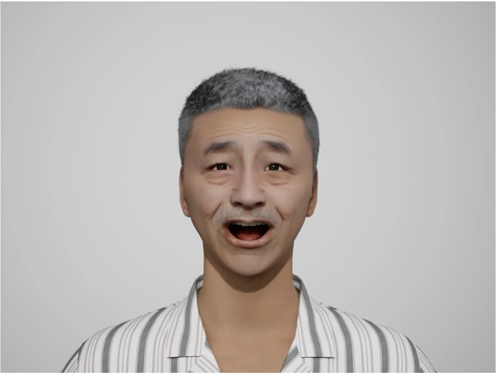
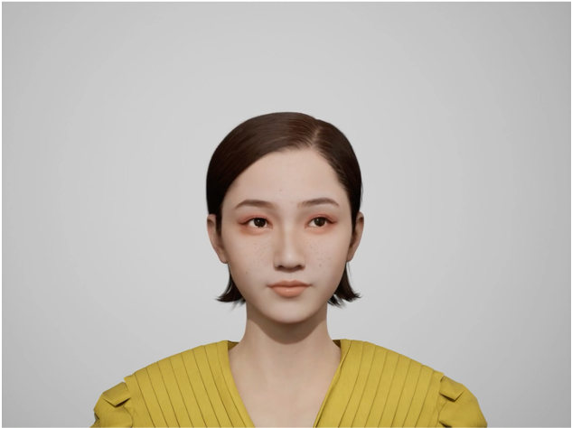
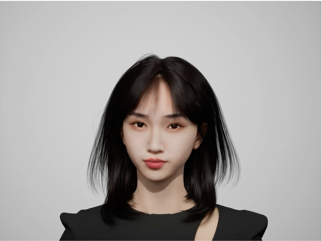
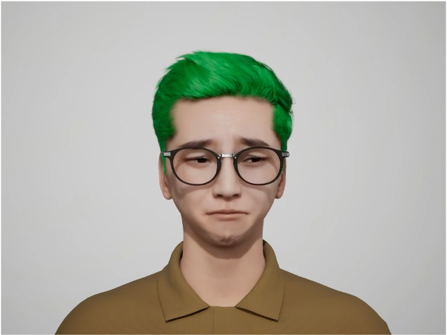
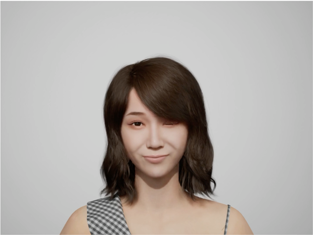
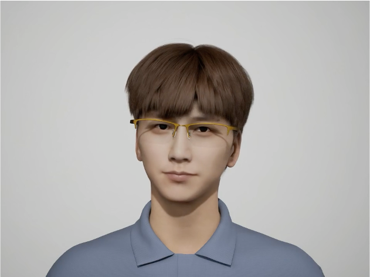
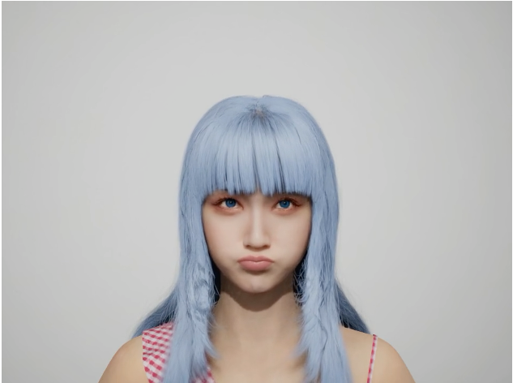
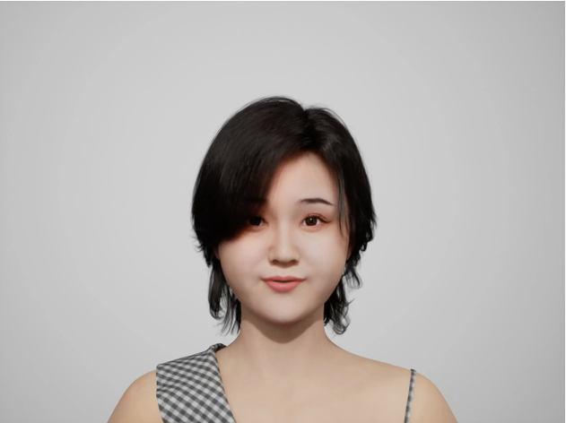
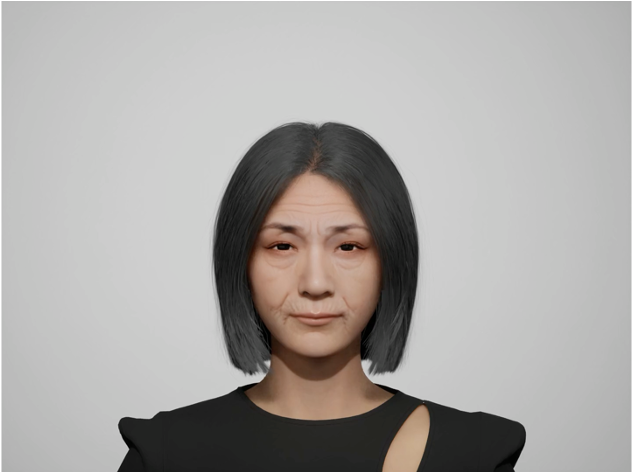
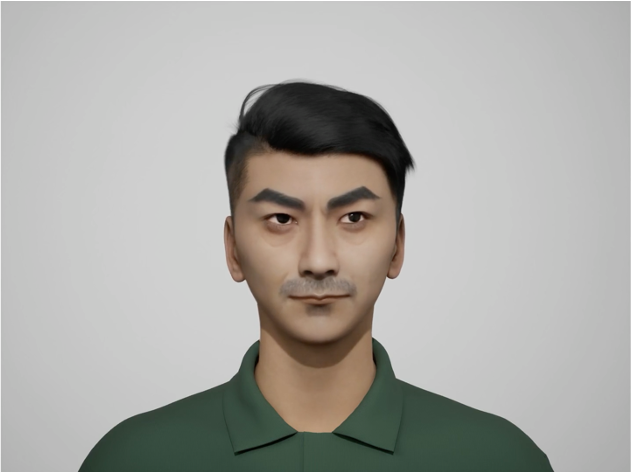

# <span style="color:orange">M</span>ake-<span style="color:orange">A</span>-<span style="color:orange">Ch</span>aracter
 
<a href='https://human3daigc.github.io/MACH/'></a>  <a href='https://arxiv.org/pdf/2312.15430.pdf'></a> [](https://www.youtube.com/watch?v=f6hkGOr_Xrc)
<a href='https://www.modelscope.cn/studios/XR-3D/InstructDynamicAvatar/summary'></a> 
 
###  Make-A-Character: High Quality Text-to-3D Character Generation within Minutes
Institute for Intelligent Computing, Alibaba Group

## Introduction


#### With Make-A-Character, you can effortlessly generate controllable, realistic, animatable 3D characters from text descriptions, which are compatible to standard CG pipelines.


For better visual experience, please visit  <a href='https://human3daigc.github.io/MACH/'></a> 
 
## 🔥News

(2023-12) The experience demo of Make-A-Character is coming soon.

<font>**Note: We will continue to update our progress on <b>3D human generation & animation</b> within this repository, please star the project to stay informed with the latest developments.**</font>

## Todo

* Integration with Audio2Face 
* Support for multiple styles
 
## Examples


<table style="border: none;">
  <tr>
    <td width="20%" align="left" valign="top">
      
      <br>
      An old man with wrinkles on his face, he has gray hair.
    </td>
    <td width="20%" align="left" valign="top">
      
      <br>
      A cool girl, sporting ear-length short hair, freckles on her cheek.
    </td>
    <td width="20%" align="left" valign="top">
      
      <br>
      Chinese girl, Bobo haircut with a straight bangs, around 20 years old. She has a V-shaped face, cameo lipstick.
    </td>
    <td width="20%" align="left" valign="top">
      
      <br>
      A boy with brown skin and black glasses, green hair.
    </td>
    <td width="20%" align="left" valign="top">
      
      <br>
      A girl, she is thin, willow leaf eyebrow,  oval face, long curly hair.
    </td>
  </tr>
  <tr>
    <td align="left" valign="top">
      
      <br>
      A handsome man with glasses,  brown hair and black eyes.
    </td>
    <td align="left" valign="top">
      
      <br>
      Pretty girl, diamond face, blue eyes.
    </td>
    <td align="left" valign="top">
      
      <br>
      A chubby lady with round face.
    </td>
    <td align="left" valign="top">
      
      <br>
      An elderly lady,  gray short hair.
    </td>
    <td align="left" valign="top">
      
      <br>
      A middle-aged man, sword-like eyebrow, black short hair.
    </td>
  </tr>
</table>
 
 
## BibTeX	

```
@article{ren2023makeacharacter,
      title={Make-A-Character: High Quality Text-to-3D Character Generation within Minutes},
      author={Jianqiang Ren and Chao He and Lin Liu and Jiahao Chen and Yutong Wang and Yafei Song and Jianfang Li and Tangli Xue and Siqi Hu and Tao Chen and Kunkun Zheng and Jianjing Xiang and Liefeng Bo},
      year={2023},
      journal = {arXiv preprint arXiv:2312.15430}
}

```
